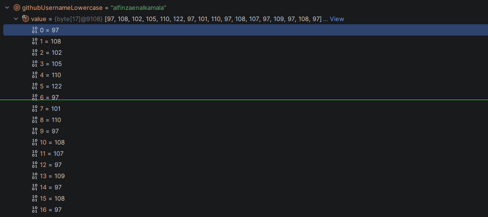
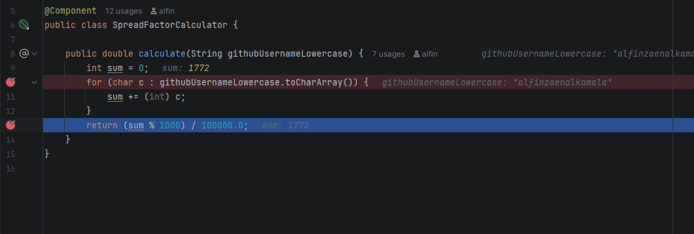
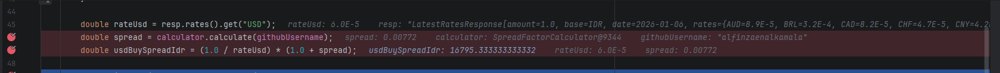

# Allo Bank – Backend Developer Take-Home Test

**Tech Stack:**  
Java 17 · Spring Boot 4 · Reactive WebFlux · Strategy Pattern · ApplicationRunner · Immutable In-Memory Store

---

## Overview

This project is a Spring Boot application developed to fulfill the **Allo Bank Backend Developer Take-Home Test**.

The application aggregates multiple resources from the **public, keyless Frankfurter Exchange Rate API**, preloads the data at application startup, stores it in a thread-safe immutable in-memory cache, and exposes a **single polymorphic REST API endpoint** to retrieve the preloaded data.

The solution focuses not only on functional correctness, but also on:
- Clean architecture
- Proper use of design patterns
- Spring Framework best practices
- Thread safety and immutability
- Testability and production readiness

---

## Features

### Startup Data Preloading
The application uses `ApplicationRunner` to:
- Execute **three distinct data fetcher strategies**
- Call the external Frankfurter API **only once during startup**
- Store the aggregated results in a **thread-safe, immutable in-memory store**
- Serve all API requests from memory (no external calls at runtime)

---

### Strategy Pattern
Each resource type is handled by its own strategy implementation:
- `latest_idr_rates`
- `historical_idr_usd`
- `supported_currencies`

All strategies implement a common interface and are resolved dynamically using **Spring-injected map lookup**, avoiding conditional logic such as `if/else` or `switch` statements.

This approach improves extensibility and maintainability.

---

### Personalized USD Buy Spread Calculation
For the `latest_idr_rates` resource, a personalized financial spread is calculated based on the developer’s GitHub username.

The calculated value is exposed as:
- `USD_BuySpread_IDR`

---

### Reactive External API Client
- Uses Spring WebFlux `WebClient`
- Created via a custom `FactoryBean`
- Externalized configuration (base URL and timeout)
- Clean separation between infrastructure and business logic

---

### Production-Quality Design
- Clear separation of concerns
- Centralized error handling
- Immutable data structures
- Unit and integration tests
- Clean and readable code structure

---

## Setup & Installation

### Clone Repository
```bash
git clone https://github.com/alfinzaenalkamala/allo-backend-test.git
cd allo-backend-test
```

### Build Application
```bash
mvn clean install
```

### Run Application
```bash
mvn spring-boot:run
```

### Run Tests
```bash
mvn test
```

---

## Configuration

Application configuration is externalized using `application.properties`.

Example configuration:

```properties
spring.application.name=allo
external.frankfurter.base-url=https://api.frankfurter.app
external.frankfurter.timeout-ms=3000
app.github-username=alfinzaenalkamala
```

---

## API Usage

### Endpoint
```
GET /api/finance/data/{resourceType}
```

### Supported Resource Types

| Resource Type | Description |
|--------------|-------------|
| latest_idr_rates | Latest IDR rates with personalized USD_BuySpread_IDR |
| historical_idr_usd | Historical USD rates when base = IDR |
| supported_currencies | List of supported currencies |

### Example Requests

Latest IDR Rates:
```bash
curl http://localhost:8080/api/finance/data/latest_idr_rates
```

Historical IDR → USD:
```bash
curl http://localhost:8080/api/finance/data/historical_idr_usd
```

Supported Currencies:
```bash
curl http://localhost:8080/api/finance/data/supported_currencies
```

---

## Personalization – Spread Factor Calculation

### GitHub Username
```
alfinzaenalkamala
```
### ASCII Value Sum



Total ASCII Value = 1772


### Spread Factor Formula

```
Spread Factor = (ASCII sum of username % 1000) / 100000.0
```




Total spread factor = 0.00772

This produces a unique value in the range:
```
0.00000 – 0.00999
```

### Final Calculation
```
USD_BuySpread_IDR = (1 / Rate_USD) * (1 + Spread Factor)
```

This calculation is applied **only** to the `latest_idr_rates` resource.

---

## Architecture Overview

### Package Responsibilities

| Package | Responsibility |
|-------|----------------|
| config | External API configuration and WebClient FactoryBean |
| controller | REST API endpoint |
| dto | Request/response and internal data models |
| exception | Centralized exception handling |
| runner | Startup data loader (ApplicationRunner) |
| service | In-memory data store and strategy registry |
| strategy | Strategy Pattern implementations |
| spread | Spread factor calculation logic |
| client | Frankfurter API adapter |

---

### Startup Flow

```
Application Startup
        ↓
ApplicationRunner
        ↓
Execute Strategy Fetchers
 (latest | historical | currencies)
        ↓
External API Calls (once)
        ↓
Immutable In-Memory Store
        ↓
REST API serves cached data

```

### In-Memory Data Store
- Thread-safe
- Immutable after startup
- Optimized for read-heavy workloads

---

## Testing

### Unit Tests
Unit tests cover:
- Spread factor calculation
- Latest IDR rates fetcher
- Historical IDR–USD fetcher
- Supported currencies fetcher

External API calls are mocked to ensure isolation and deterministic behavior.

---

### Integration Tests
Integration tests ensure:
- Data is preloaded during application startup
- API endpoints return cached data
- Startup behavior is predictable and reliable

---

## Error Handling

The application gracefully handles:
- External API timeouts
- Invalid or missing response data
- HTTP 4xx / 5xx responses


---

## Author

**Alfin Zaenal Kamala**  
Backend Engineer  
Spring Boot 

---
